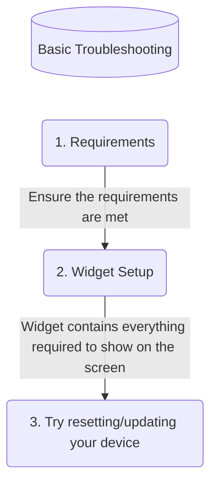
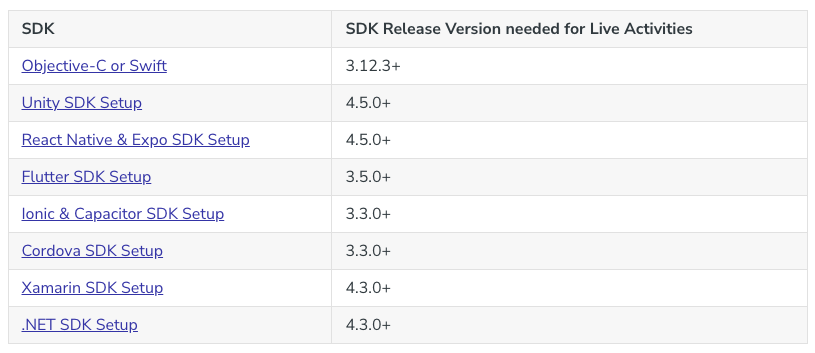
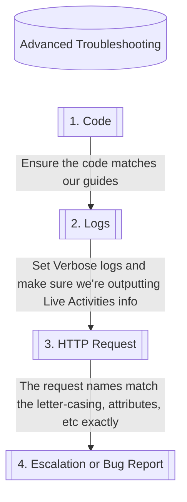
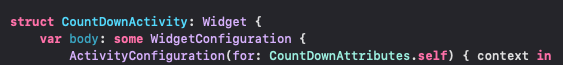
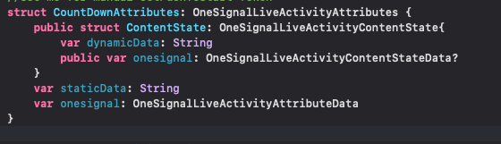
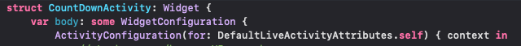
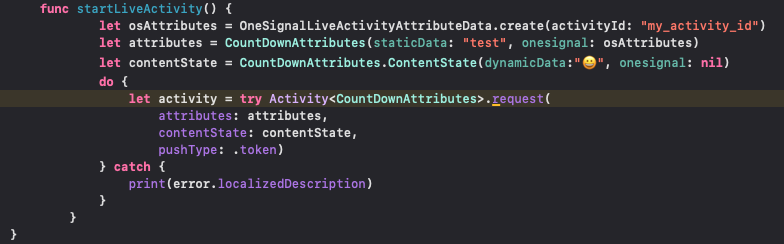
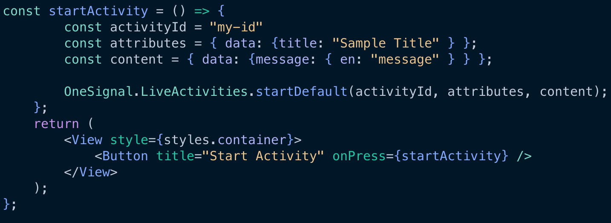
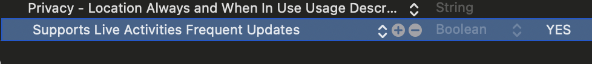
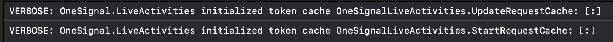

# Always clarify, "What issues are we seeing? What have you tried so far?"
### Basic Checklist:



#### Are the basic requirements met? What has been done so far to test?
- What SDK Version are you on? Here are the absolute minimums needed for live activities (not including updates that allow for push to start, only for live activity support):

- Are you using a physical device or a simulator? Have you tried using other devices yet, or just the one you initially tested with?
	- If this is happening across one device or device type (e.g. only on simulators) and not another, let's try to reinstall the app and see if a refresh like this helps apple update the token properly.
- Let's now double check that the following requirements are met before anything else : 
	- An iOS / iPadOS Application (Live Activities are only available on the iPhone and iPad).
	- Ensure you are using a .p8 key. Check out our guide, [iOS: Establishing a Token-Based Connection to APNs (.p8 Key)](https://documentation.onesignal.com/docs/establishing-an-apns-authentication-key), if migrating away from a .p12 certificate.
	- Live Activities are available on iOS 16.1+, which is supported on iPhones made in 2017 or newer, and iPadOS 17 and later.
	- Xcode 14 and later.
	- The latest iOS SDK or wrapper.

### Advanced Troubleshooting


### A more granular look at the set up
- Are we using iOS native or a Wrapper SDK like React Native, Flutter, etc.?
	- #### iOS Native:
		- Requires the most customization in regards to working with Live Activities. The files that must be touched here are `<your_widget_name>LiveActivity.swift` and any point in your project you want to call LiveActivity methods (e.g. AppDelegate, ContentView, etc.)
		- What to look for:
			- Are we using the OneSignal `setup` / `setupDefault` methods? If so, we want to make sure that we're using the right "Activity Type" in the Widget UI. Here we have a "non-default" type (but native also has access to the default activity type like the wrapper below) so we use the Attribute name in here after `for:` 
			
			- If using your own custom attributes, you'd do the same but you'll want to define that struct yourself instead of using the default one from OneSignal. That might look like this, and allows for more flexibility (and strong typing):
			
	- #### Wrapper SDK's:
		- These are cross platform and generally are for people who do not want to engage with any native iOS code (Swift/Objective C). The **latest** SDK's will have a default live activity type built in to help avoid as much native code as possible but there is still mandatory work to do in XCode to get set up. The files you must interact with on Xcode are `<your_widget_name>LiveActivity.swift` where you would design the UI. All other methods can be written in the Wrapper SDK language.
			- If you choose to not use `setupDefault` then you will need to create a struct like what is shown above and handle more code natively. The Default Activity we provide allows you to add any fields you want with any type so you can add and remove fields however you'd like. 			 
			- we would not recommend making your own struct outside of the default activity type unless you are comfortable with writing native code.
	- while checking the logic above, we've confirmed that you have the correct ui and activity type to work with live activities. if you have doubts, you can always check the example project in the latest version of the sdk you're using. the ios folder will contain this widget for you to compare to.
- let's now briefly look over the code to make sure it's doing what we intend for it to do:
	- do we want to use push to start live activities?
		- we should have `onesignal.liveactivities.setup` or `onesignal.liveactivities.setupdefault` and the argument should match whatever our activity type is like this for native: `onesignal.liveactivities.setup(myattributes.self)` and this for default activities: `onesignal.liveactivities.setupdefault()`
	- do we want to launch live activities from within the app (button click, when a user triggers an event, etc.)?
		- we should see the activity being started somewhere in the code. 
		#### native sdk: 
		- this would have something like this (only if using a `setup/setupdefault` method), where we define the activity type in the code, get the token that `setup` creates for us and we pass in whatever attributes and state we want the user to have on their screen for the first launch of the widget.
		
		#### wrapper sdk: 
		- This should use a `start` method in the wrapper sdk code, otherwise, the example above would be followed on the native side to customize anything beyond this.
		`OneSignal.LiveActivities.startDefault(activityid, activityattributes, initialcontentstate)` 
		Example from a React Native project:
				
#### Everything looks good, but it's still not working
- At this point, the easiest path to understanding what is happening here is to look into the verbose SDK logs. If you do not have logging enabled for your code, please [follow this guide](https://documentation.onesignal.com/docs/capturing-a-debug-log).
	- This portion of the guide will cover logging from the SDK when using the setup method, as it outputs much more verbose details into the Live Activity process. If you are using a lower level method to generate your own tokens, a breakpoint should be set to ensure that you are getting a start or update token back when trying to manually create one.
		- If you are using a device that is plugged in, or a simulator, you can run this command from your terminal to output live activity logs from OneSignal as well as native services like `liveactivitiesd` which might show some other issues that our SDK cannot see:
		`xcrun simctl spawn booted log stream — level=debug | grep -i "onesignal"
	- When using a `setup` method from the OneSignal SDK, you should see a few process being shown in the logs right when the SDK initializes. Here is some of what you might see, and what they mean:
		- `VERBOSE: OneSignal.LiveActivities listening for activity on: DefaultLiveActivityAttributes` This is us determining that we need to retrieve a token, which we request from Apple. 
		- `VERBOSE: OneSignal.LiveActivities setStartToken called with activityType: DefaultLiveActivityAttributes token: 8069c8479d39b30c2d19f18752b80661b3da1cf2b1e3d3f4f71eb6fe34575b62e254efa0b1b66452cf1a346e6f288.....` This is output after we send a push to start message to our device. It is confirming the token that we've received from Apple.
		- `VERBOSE: OneSignal.LiveActivities enter called with activityId: my_activity_id token: 80deb62e341622ff221374f0ff0076ce2a140f9a40e3b7753d10a025eb0eddafefea812e17cea8c0b299d3ae21696981d...` This is the output after we launch a live activity from a button click in the app. We can see the activity id before the token and that should match what you've added in the code where you manually launch the activity.
- Tokens are the key to enabling these Live Activities, so it's important to look for these two possible issues first, and then at the request itself to start the activity in the next section below: 
	1. The logs are not showing any of the information above.
	- In this case, we want to make sure we do see logging from the SDK at all to ensure the setLogLevel method is working as intended. You can search for "VERBOSE" in your logs to make sure you see some lines that say OneSignal.
	2.  The logs shows we're ready to listen for the activity request, but when asking for a token, we don't receive one.
	- This is more common for Wrapper SDK's and Apple essentially needs to be "woken up" to ask for the token. To do this, you would launch the activity with a button click and then that token would get cached for the OneSignal SDK to use again in the future. This is something that Apple has not provided a reason for when asked, so it is a workaround at this point in time. 
#### Let's now take a look at a valid push to start POST request and break it down into pieces to confirm we've checked everything is matching correctly : 
- This is where you will find the answer to most `no recipients` errors that you see on the dashboard. We need to identify how the request is made and determine if the information matches up correctly.

--- 
```
curl --location 'https://app.onesignal.com/api/v1/apps/YOURAPPID/activities/activity/YOURACTIVITYTYPE' \
```
- The App ID must match your App ID used in the `OneSignal.Initialize` method in your app
- **IMPORTANT**: The upper and lower case letters in your path matter! If you have an activity like `struct UpperCaselowercaseAttributes`, it should match what is in the url here too `/activities/activity/UpperCaselowercaseAttributes`
---
`--header 'Authorization: Basic APIKEY' \`
- OneSignal API endpoints require the use of a Basic Authorization key. It should be formatted like this and you should replace APIKEY with [your own for the app](https://documentation.onesignal.com/docs/keys-and-ids) you're making a request to.
--- 
```
--header 'Content-Type: application/json'
--data '{
	"event": "start",
```
- The `event` parameter to start a Live Activity should contain the value : `start`
--- 
```
"event_updates": {`
	`"dynamicData": "test"`
`},
```
- The `event_updates` parameter should contain any **dynamic** data that you plan on updating. This would be the variables in your UI with the word "state" in them (e.g. `context.state.dynamicData`
---
```
"event_attributes": {
	"staticData": "test"
},
```
- The `event_attributes` parameter should contain any **static** data that you plan on adding only once (e.g Titles, Delivery Driver name, etc.) This would be the variables in your UI with the word "attributes" in them (e.g. `context.attributes.staticData`)
---
`"included_segments": \["Subscribed Users"\],`
- Just like a push message, this is what you want to use to choose the target audience for the Live Activity. If a user is not in the segment, they won't receive the Live Activity. The same applies for the other ways to choose an audience which you can find [here](https://documentation.onesignal.com/reference/notification-parameters#targeting).
---
```
"activity_id": "my-id",
	"name": "Zenni Showcase",
	"contents": {
		"en": "English Message"
	},
```
- The most important field here is going to be the `activity_id` This is the id for the widget that goes live on the end-user's screen and if you use the same one, it will overwrite any existing widget with that same ID. If you want to show multiple widgets, you would change this ID and you can show up to 5 live activities at a time per user.
- The other fields available here should not cause any issues, but contents is required and name is suggested to be able to identify the activity from your dashboard. See all parameters available [here](https://documentation.onesignal.com/reference/live-activity-parameters#name).
---
	`"priority": 10}'
- Lastly, `priority` is going to tell Apple whether this should be sent immediately, as fast as it can be processed. It should be used with caution though, as Apple does not specify it's rate limits when it comes to throttling requests. You should ensure that if you set this priority to a have integer, you are also adding this to your plist:

### Key things to keep in mind :
Live Activities are complicated so it's important to make sure you have correctly configured 
1. The Widget 
2. The Code 
3. The Push To Start API Request

`enter`, `exit`, `setPushToStartToken`, `removePushToStartToken` all are low level and we do not suggest using these. `setup` and `setupDefault` take a bulk of the work out of what is needed to generate and listen for tokens. There is also features in this that allow for the addition of more functionality added in the future that you will need to account for manually if the Live Activities product grows to include more functionality.

`setup` gets the push to start **and** update tokens, and then it sends it to the backend to ensure that the value is stored for the next instance they're needed.
- PTS tokens = 1 token per activity type
- Update tokens = 1 token per activity instance

Your device doesn't know what the token is unless you create it yourself manually using the low-level code.

The only way to intentionally remove a token is with the low-level removePTSToken method

Known Issue : Token cache resets on app open. This is inconsequential for the end user, but it means that you might not see a token retrieved from the cache when the `setup` method is used like this : 
This does not mean anything is going to work differently, and when receiving any PTS request or button click to enter an activity, you should then see the token shown. If not, follow the troubleshooting steps above.
